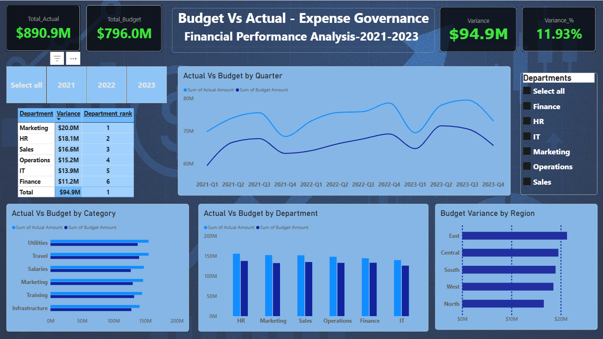

# 💰 Budget vs Actual — Departmental Expense Governance Dashboard

An interactive Power BI dashboard analyzing budget vs. actual spending across departments, regions, and categories, built on a properly modeled star schema.



---

## 🎯 Business Problem

Organizations often struggle to track where and why actual spending deviates from planned budgets.

This project answers key financial governance questions:

- 📊 Which departments are exceeding their budgets?
- 🌍 Which regions show the highest cost overruns?
- 📈 How has the budget-vs-actual gap changed over time?
- 💰 Which spending categories require closer monitoring?

---

## 📂 Dataset

| Attribute | Details |
|---|---|
| **Source** | [Kaggle — Budget vs Actual Dataset](https://www.kaggle.com/datasets/kennathalexanderroy/budget-vs-actual-financial-dataset) |
| **Records** | ~10,000 transactions |
| **Period** | January 2021 – December 2023 |
| **Fields** | Date, Department, Category, Region, Budget Amount, Actual Amount, Payment Method, Transaction ID |
| **Grain** | One row per transaction |

---

## 🧹 Data Preparation

Data was validated and prepared using **Power Query**:

Raw data required cleaning before modeling:
- Removed fully duplicate rows and rows with missing Transaction IDs
- Handled missing values in Department, Category, and Region by mapping them to an explicit "Unknown" category (rather than leaving blanks, to keep aggregations accurate and auditable)
- Trimmed whitespace and standardized text casing across all categorical columns
- Verified duplicate Transaction IDs and confirmed they did not distort aggregate totals
---

## 🏗️ Data Model

Built using a **star schema**:

- 📌 `Fact_BudgetActual` — transaction-level financial data
- 📅 `Dim_Date`
- 🏢 `Dim_Department`
- 🗂️ `Dim_Category`
- 🌍 `Dim_Region`
- 💳 `Dim_PaymentMethod`

Dimension tables are connected to the fact table using **one-to-many relationships** with single-direction filtering.

---
## 🧮 Key DAX Measures

```DAX
Total Budget =
SUM(Fact_BudgetActual[Budget Amount])
```
```
Total Actual =
SUM(Fact_BudgetActual[Actual Amount])
```
```
Budget Variance =
[Total Actual] - [Total Budget]
```
```
Variance % =
DIVIDE(
    [Budget Variance],
    [Total Budget],
    0
)
```
```

Department_rank =
RANKX(
    ALL(Dim_Department[Department]),
    [Variance],
    ,
    DESC
)
```

`Department_rank` uses `RANKX` combined with `ALL()` to rank departments by overspend regardless of any slicer selection, allowing consistent prioritization of departments needing budget review.

## 💡 Key Insights
- Overall actual spend ($144.2M) exceeded budget ($133.0M) by **$11.2M (8.39%)** across the 3-year period.
- **Marketing** is the top overspending department, followed by **HR** and **Sales** — while **Finance** and **IT** stayed closest to plan.
- **East** region shows the highest variance, with **North** performing best against budget.
- Actual spend has consistently tracked above budget across nearly every quarter from 2021–2023, indicating a systemic (not one-off) planning gap rather than isolated incidents.

---
## 🛠️ Tools Used

Power BI Desktop (Power Query, Data Modeling, DAX)

## 📁 Files

- [📊 Budget_Variance_Dashboard.pbix](Budget_Variance_Dashboard.pbix) — full Power BI file
- [🖼️ Dashboard Screenshot](Budget_vs_Actual.png) — dashboard preview


